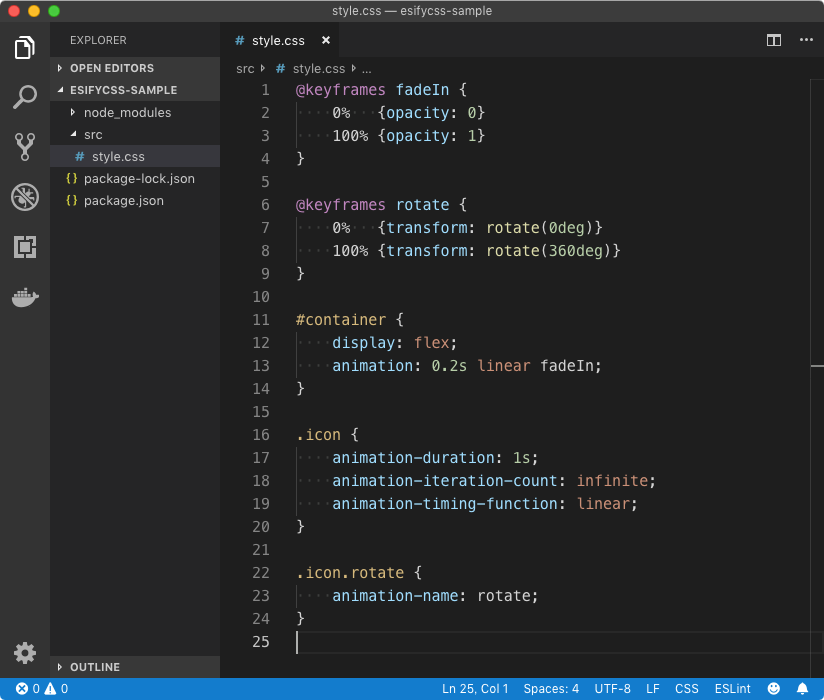
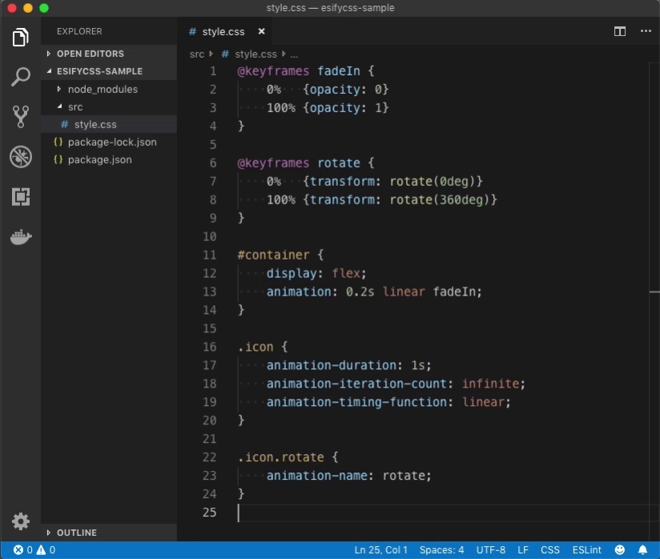
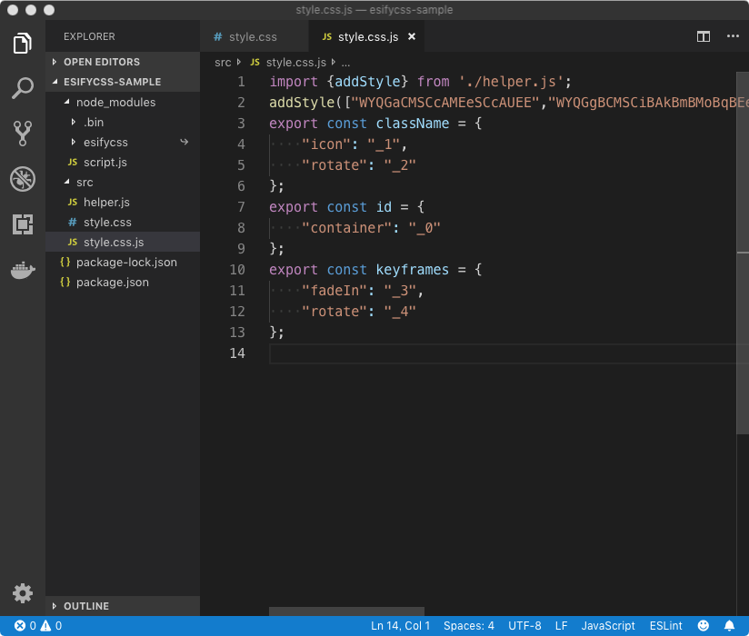

# EsifyCSS

[](https://circleci.com/gh/kei-ito/esifycss)
[](https://travis-ci.com/kei-ito/esifycss)
[](https://ci.appveyor.com/project/kei-ito/esifycss/branch/master)
[](https://www.browserstack.com/automate/public-build/WDQvOHgwbkRNTUFyUVkrc0RmdGgva0diVk01Tm9LWU95ZFNGVTByeHhpVT0tLUc2RW9lNnNaY2k4QkVCSjMyalRGTVE9PQ==--007efb48774305e72904bb3a15d3b0d048dbfb91)
[](https://codecov.io/gh/kei-ito/esifycss)

Generates modules from CSS.

Assume you have [`style.css`](sample/01-mangle/sample.css) below.



Then, run the `esifycss` command.



You'll get [`style.css.js`](sample/01-mangle/sample.css.js) (and [`helper.js`](sample/01-mangle/helper.js)).



You can import the generated script from
It exports `className`, `id`, and `keyframes` that are shortened uniquely.
The uniqueness makes styles modular. This means you don't have to concern about
naming somethings in CSS.

Each string given to `addStyle` represents a CSS string.
They are inserted to the document's stylesheet by the helper script.

EsifyCSS consists of a **PostCSS plugin** and a **Runner**.

## PostCSS plugin

The plugin converts the identifiers in CSS and minifies them.
It outputs the result of minifications using [Root.warn()].

[Root.warn()]: http://api.postcss.org/Root.html#warn

## Runner

A runner process `.css` files in your project with PostCSS and output the
results to `.css.js` or `.css.ts`.

## Installation

```bash
npm install --save-dev esifycss
```

## Usage

```
Usage: esifycss [options] <include ...>

Options:
  -V, --version         output the version number
  --helper <path>       A path to the helper script.
  --config <path>       A path to configuration files.
  --exclude <path ...>  Paths or patterns to be excluded.
  --noMangle            Keep the original name for debugging.
  --watch               Watch files and update the modules automatically.
  -h, --help            output usage information
```

## `@import` Syntax

You can use `@import` syntax when the style declarations requires names in external files.

Example: Assume you have the following `a.css` and `b.css`.

```css
/* a.css */
.container {...} /* → ._0 */
```

```css
/* b.css */
.container {...} /* → ._1 */
```

The `container` class names will be shortened to unique names like
`_0` and `_1`.
You can import the shortened names with the `@import` syntax.

```css
/* "modA-" is prefix for a.css */
@import './a.css' modA-;
/* "bbbb" is prefix for b.css */
@import './b.css' BBB;
.wrapper>.modA-container {...} /* → ._2>._0 */
.wrapper>.BBBcontainer {...}   /* → ._2>._1 */
```

## JavaScript API for Runner

```javascript
import {Session} from 'esifycss';
new Session(options).start()
.then(() => console.log('Done'))
.catch((error) => console.error(error));
```

### Options

```typescript
export interface ISessionOptions {
  /**
   * Pattern(s) to be included
   * @default "** / *.css"
   */
  include?: string | Array<string>,
  /**
   * Pattern(s) to be excluded.
   * @default []
   */
  exclude?: anymatch.Matcher,
  /**
   * Where this plugin outputs the helper script.
   * The hash in the default value is calculated from the include.
   * @default "helper.{hash}.css.js"
   */
  helper?: string,
  /**
   * It it is true, a watcher is enabled.
   * @default false
   */
  watch?: boolean,
  /**
   * Options passed to chokidar.
   * You can't set ignoreInitial to true.
   * @default {
   *   ignore: exclude,
   *   ignoreInitial: false,
   *   useFsEvents: false,
   * }
   */
  chokidar?: chokidar.WatchOptions,
  /**
   * An array of postcss plugins.
   * esifycss.plugin is appended to this array.
   * @default []
   */
  postcssPlugins?: Array<postcss.AcceptedPlugin>,
  /**
   * Parameters for esifycss.plugin.
   */
  esifycssPluginParameter?: IPluginOptions,
  /**
   * A stream where the runner outputs logs.
   * @default process.stdout
   */
  stdout?: stream.Writable,
  /**
   * A stream where the runner outputs errorlogs.
   * @default process.stderr
   */
  stderr?: stream.Writable,
}
```

Source: [src/runner/types.ts](src/runner/types.ts)

## JavaScript API for Plugin

```javascript
const postcss = require('postcss');
const esifycss = require('esifycss');
postcss([
  esifycss.plugin({/* Plugin Options */}),
])
.process(css, {from: '/foo/bar.css'})
.then((result) => {
  const pluginResult = esifycss.extractPluginResult(result);
  console.log(pluginResult);
  // → {
  //   className: {bar: '_1'},
  //   id: {foo: '_0'},
  //   keyframes: {aaa: '_2'},
  // }
});
```

The code is at [sample/plugin.js](sample/plugin.js).
You can run it by `node sample/plugin.js` after cloning this repository and
running `npm run build`.

### Options

```typescript
export interface IPluginOptions {
    /**
     * When it is true, this plugin minifies classnames.
     * @default true
     */
    mangle?: boolean,
    /**
     * A function returns an unique number from a given file id. If you process
     * CSS files in multiple postcss processes, you should create an identifier
     * outside the processes and pass it as this value to keep the uniqueness
     * of mangled outputs.
     * @default esifycss.createIdentifier()
     */
    identifier?: IIdentifier,
    /**
     * Names starts with this value are not passed to mangler but replaced with
     * unprefixed names.
     * @default "raw-"
     */
    rawPrefix?: string,
    /**
     * A custom mangler: (*id*, *type*, *name*) => string.
     * - *id*: string. A filepath to the CSS.
     * - *type*: 'id' | 'class' | 'keyframes'. The type of *name*
     * - *name*: string. An identifier in the style.
     *
     * If mangler is set, `mangle` and `identifier` options are ignored.
     *
     * For example, If the plugin processes `.foo{color:green}` in `/a.css`,
     * The mangler is called with `("/a.css", "class", "foo")`. A mangler should
     * return an unique string for each input pattern or the styles will be
     * overwritten unexpectedly.
     * @default undefined
     */
    mangler?: IPluginMangler,
}
```

Source: [src/postcssPlugin/types.ts](src/postcssPlugin/types.ts)

## LICENSE

The esifycss project is licensed under the terms of the Apache 2.0 License.
